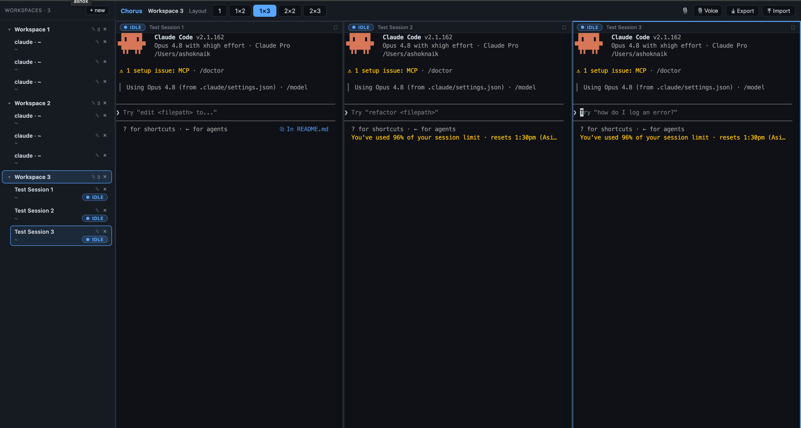

# Chorus — Parallel Claude Code Terminal Manager

Run multiple Claude Code sessions in parallel inside a single window: a
resizable grid of terminal panes grouped into **workspaces**, a two-tier sidebar
with live status badges, adjustable layouts, and pane maximize. Workspaces,
layouts and sessions are **persisted** and restored on relaunch. A focused,
open-source take on the BridgeSpace / cmux idea, scoped to Claude Code.



> Built bottom-up against a stable `PtyBackend` seam so the whole UI runs in a
> browser dev harness *and* the Electron desktop app from the same `@app/ui` —
> only the host transport differs (websockets vs. Electron IPC).

## Features

- **Layout templates** — 1, 1×2, 1×3, 2×2, 2×3 panes (the layout tree supports
  arbitrary nesting), with draggable dividers that reflow the PTYs.
- **Multi-workspace** — a workspace is a named group of sessions with its own
  layout and a default working directory new panes inherit. The two-tier sidebar
  shows workspaces as collapsible groups with their sessions nested underneath.
- **Naming** — name a session when you launch it, and rename any workspace or
  session anytime (✎ button, or double-click).
- **Live status** — per-session badges (idle / waiting / running …) driven by
  Claude Code hooks → OSC, with a stream heuristic fallback. A workspace with a
  waiting session shows an attention dot.
- **Maximize** — zoom one pane to fill the area; other panes stay mounted and
  their PTYs keep running.
- **Persistence** — workspaces, layouts, sessions and cwds survive a reload
  (web: localStorage) or relaunch (desktop: a JSON file in userData). Saved
  sessions are re-spawned automatically.

## Architecture

TypeScript monorepo (npm workspaces + Turborepo). The UI depends only on
`@app/core` **interfaces**; each host injects a concrete `PtyBackend` +
`Persistence`.

```
packages/
  core/          @app/core — framework-agnostic models, the PtyBackend +
                 Persistence seams, status reducer, layout tree, workspace
                 ops, OSC scanner (zero UI/host deps)
  ui/            @app/ui   — React + xterm.js (TerminalPane, LayoutView,
                 two-tier Sidebar, PaneLauncher, StatusBadge, App)
  app-web/       dev harness — Vite page + ws server + node-pty;
                 WebPtyBackend + WebPersistence (localStorage)
  app-electron/  Electron host — main: node-pty over IPC; preload:
                 contextBridge; renderer: ElectronPtyBackend +
                 ElectronPersistence + the same @app/ui App
```

The single seam between UI and host is `PtyBackend` (terminal I/O) and
`Persistence` (workspace state). See `packages/core/src/`.

## Requirements

- Node >= 20 (developed on Node 22)
- A C toolchain for `node-pty` (Xcode CLT on macOS, build-essential on Linux,
  VS Build Tools on Windows)
- `claude` on your `PATH` to launch real Claude Code sessions

## Build, run & verify

### 1. Install + build the packages

```bash
npm install          # installs all workspaces; builds node-pty natively
                     # (postinstall fixes the node-pty spawn-helper exec bit)
npm run build        # turbo build across all packages
npm run typecheck    # type-check everything
npm run test         # unit tests (status reducer, layout + workspace ops, …)
```

### 2. Browser harness

The dev harness runs the exact same `@app/ui` + `@app/core` the desktop app uses
— only the host transport differs (websockets here, Electron IPC there).

```bash
npm run dev:web      # starts the ws/pty server AND Vite together
```

Open the printed URL (default http://localhost:5173).

**Verify:**
- Pick a layout — **1 / 1×2 / 1×3 / 2×2 / 2×3** → that many panes appear.
- In an empty pane, optionally set a **session name**, set a working directory,
  and click **Run Claude** (or **Shell**). The terminal becomes interactive and
  the `claude` TUI renders.
- Drag the dividers between panes — terminals resize and the PTY reflows.
- Each pane is an independent session; input/output never cross panes.
- Watch the **status badge** on each pane/sidebar row change as a turn runs.
- Use the pane header's maximize button to zoom one pane and restore it.
- In the **sidebar**: create workspaces (**+ new**), collapse groups, rename a
  workspace or session (✎ / double-click), click a session to focus its pane,
  **×** to close (kills the PTY and collapses the layout).
- **Reload the page** → your workspaces, layouts and sessions come back (saved
  sessions are re-spawned).
- Close the browser tab → all child PTYs are killed (no orphan processes).

### 3. Desktop app — Electron

`packages/app-electron` is a real Electron host built with electron-vite. Because
`node-pty` is a native module, rebuild it for Electron's ABI once before running:

```bash
npm run rebuild -w app-electron   # @electron/rebuild for node-pty (one-time)
npm run dev     -w app-electron   # hot-reload Electron window
npm run dist    -w app-electron   # electron-builder: dmg / nsis / AppImage
npm run dist:dir -w app-electron  # unpacked build (no installer) for quick checks
```

Installers land in `packages/app-electron/release/`. Persistence is a JSON file
in the app's `userData` directory.

## Milestones

| Milestone | Epics | Outcome | Status |
|---|---|---|---|
| **M0** | 0, 1 | Browser page: one live terminal, then `claude` running in it | ✅ |
| **M1** | 2 | UI drives sessions purely through `core` + `PtyBackend` | ✅ |
| **M2** | 3, 4 | 1 / 1×2 / 2×2 layouts, resizable panes, session sidebar | ✅ |
| **M3** | 5 | Live status badges via Claude Code hooks → OSC | ✅ |
| **M4** | 6 | Multi-workspace model, 1×3 / 2×3 layouts, maximize, persistence + restore | ✅ |
| **M5** | 7 | Installable Electron app (main: node-pty over IPC; renderer: `@app/ui`) | ✅ |
| **M11** | 11 | Workspace export/import — portable `.chorus` bundle (both hosts) | ✅ |
| **M9** | 9 | Voice dictation into the focused pane (on-device WASM Whisper) | ✅ |
| **M10** | 10 | Agent swarm — broadcast, fan-out, shared blackboard, swarm view | ✅ |
| **M12** | 11 | Conversation/memory export/import + resume (Electron, Layer 2) | ✅\* |

> \* M12 is code-complete and builds; the `~/.claude` resume round-trip needs
> on-machine confirmation (see `docs/memory-capabilities.md`).

> Beyond the PRD v1: the multi-workspace model, the two-tier sidebar, the 1×3 /
> 2×3 layouts, pane maximize, and session naming are agreed extensions. **Chorus
> v2** adds voice dictation (Epic 9), agent swarms (Epic 10), and portable session
> memory (Epic 11) — all on-device / local, no cloud STT.

## Notes

- Uses **npm** workspaces (not pnpm).
- One dark theme only in v1.
- `@app/ui` depends only on `@app/core` interfaces — never a host package or
  `node-pty` directly. Hosts inject a `PtyBackend` + `Persistence`.
- Auto-update (`electron-updater`) is not wired yet — a future addition.
